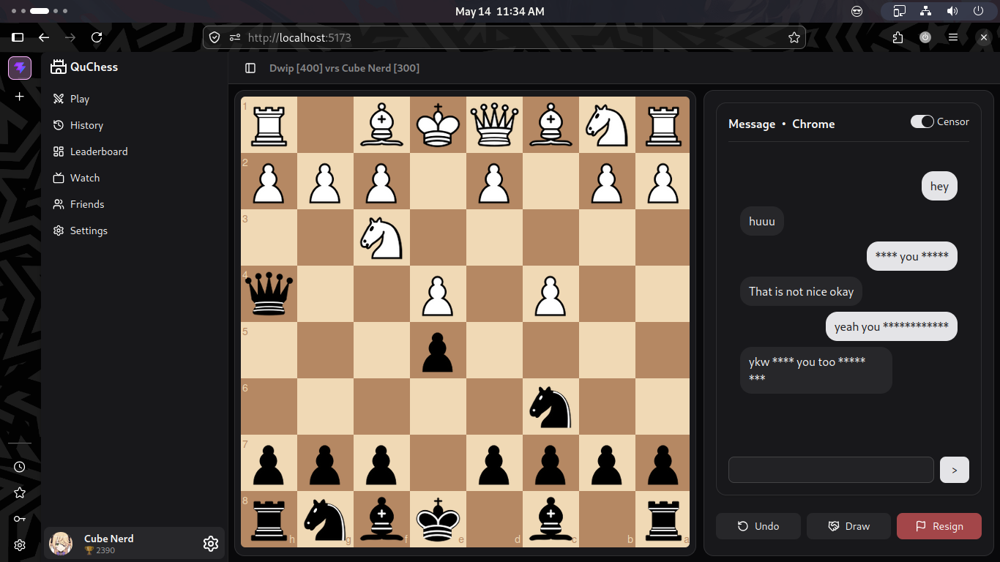
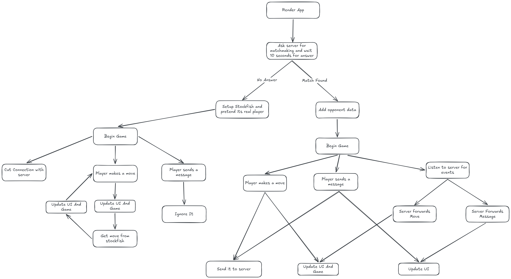
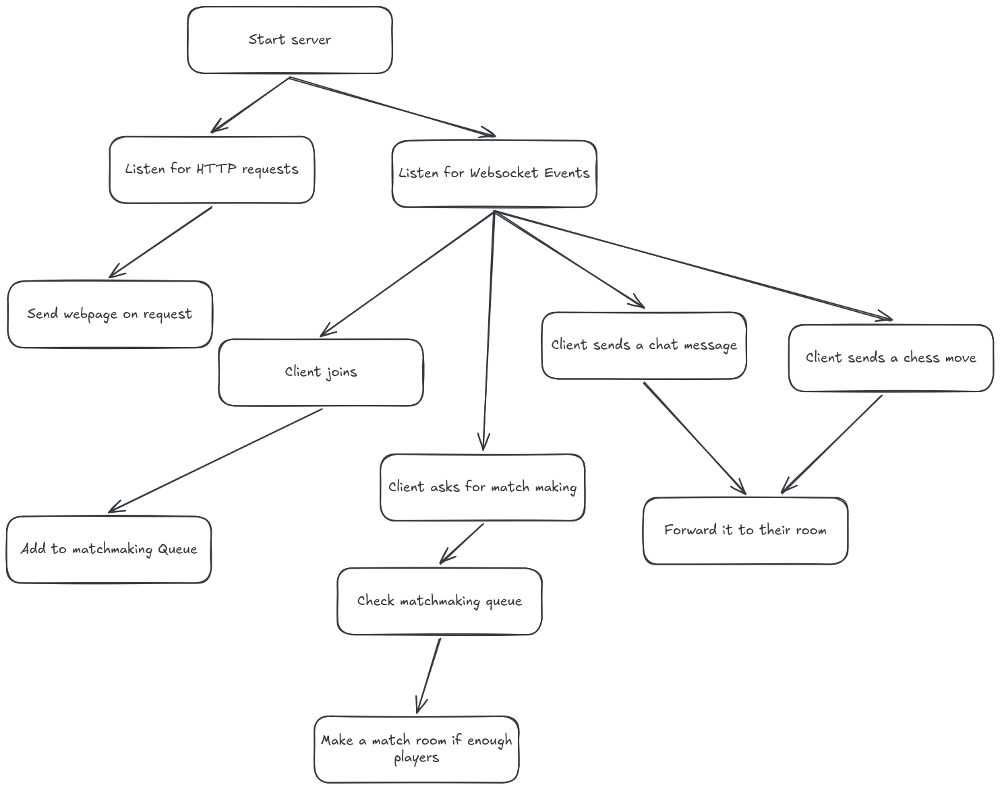

# ♟️ QuChess

An instant chess game on the web — no accounts, no setup, just play anywhere, anytime.

## ⚡ Features

- ⚡ Instant matchmaking (no login required)
- ♟️ Full chess rules (legal moves, check, checkmate)
- 🤖 Play against Stockfish when no opponent is found
- 💬 Real-time chat with optional censorship
- 🔄 Live move synchronization via WebSockets
- 📱 Responsive design (desktop + mobile)

## How the frontend works ( Simplified )

## How the backend works ( Simplified )

## 🧩 Resources Used

| Tool | Description |
|------|-------------|
| [Vue 3](https://vuejs.org/) | Progressive JavaScript Framework |
| [TailwindCSS](https://tailwindcss.com/) | Utility-first CSS framework for rapid styling |
| [shadcn-vue](https://www.shadcn-vue.com/) | Reusable component system for Vue |
| [Socket.io](https://socket.io/) | Real-time bidirectional communication |
| [Express](https://expressjs.com/) | Fast and minimal Node.js web framework |
| [chessboard.js](https://chessboardjs.com/) | Interactive chessboard UI |
| [chess.js](https://www.npmjs.com/package/chess.js) | Chess logic engine (move validation, rules, FEN) |
| [Stockfish.js](https://github.com/nmrugg/stockfish.js/) | Chess engine AI for computer opponent |
| [Vite](https://vite.dev/) | Fast frontend build tool and dev server |
| [Lucide Icons](https://lucide.dev/guide/vue/) | Clean and modern icon library |
| [bad-words](https://www.npmjs.com/package/bad-words) | Profanity filtering for chat messages |

## 📝 MIT License